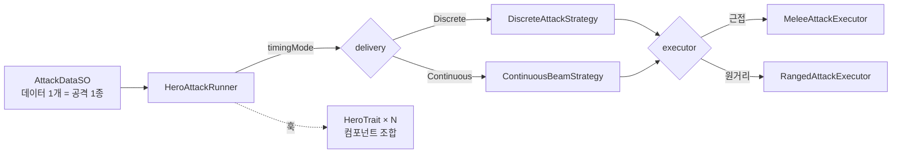
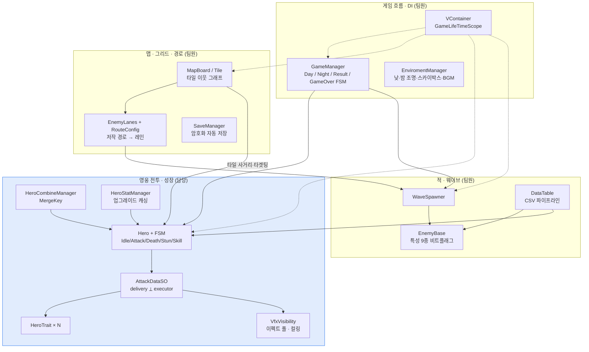

# PioneerOfFelucia

> 낮에는 마을을 세우고, 밤에는 그리드에 배치한 영웅으로 웨이브를 막는 타워 디펜스 게임

<!-- ▶️ 플레이 가능한 빌드가 있으면 이 줄에 itch.io 등 링크를 최상단에 배치 -->

<!-- 게임플레이 GIF (ShareX 녹화, docs/ 에 넣고 아래 표 주석 해제)
| 낮 ↔ 밤 전환 | 영웅 전투 VFX (장판 · 빔 · 체인) | 유닛 합성 |
| :---: | :---: | :---: |
|  |  |  |
-->

저장소명 `GyoungYilARK` 는 개발 초기 코드네임이며, 프로덕트명은 `PioneerOfFelucia` 입니다.

---

## 프로젝트 개요

| 항목 | 내용 |
| --- | --- |
| 장르 | 타워디펜스 |
| 플랫폼 | PC |
| 팀 구성 | 프로그래머 4인 |
| 개발 기간 | 2026.07 ~ 2026.09 |
| 엔진 | Unity `6000.3.15f1` (Unity 6.3) / URP `17.3` |

---

## 기술 스택

`Unity 6.3` · `C#` · `URP 17.3` · `Shader Graph` · `VFX Graph`
[`VContainer`](https://github.com/hadashiA/VContainer) (DI) · [`UniTask`](https://github.com/Cysharp/UniTask) (비동기) · `NuGetForUnity`

상태 전이는 게임/영웅 모두 직접 구현한 FSM, 이벤트는 C# `event` 기반이다.

---

## 게임 구성

### 생산 구역
**생산 건물**
- 제재소(목재), 채석장(돌), 제철소(철), 광산(금), 농장(식량), 주택(최대 인구 수 증가)
- 자원을 소모하여 업그레이드할 수 있습니다. 업그레이드 시 자원 획득량이 증가합니다.

**시민 투입**
- 시민은 식량을 소모하여 생성합니다.
- 생산 건물에 시민을 투입해야 자원을 획득할 수 있습니다.
- 투입된 시민 수에 비례하여 자원을 획득합니다.

**자원 획득**
- 밤(웨이브)가 끝날 때마다 생산 건물에서 자원을 획득합니다.

### 전투 구역
**영웅**
- 자원을 소모하여 영웅을 생성할 수 있습니다.
- 같은 영웅 3명이 있을 때 합성할 수 있습니다. 다음 티어의 랜덤한 영웅으로 합성됩니다.
- 자원을 소모하여 업그레이드할 수 있습니다. 업그레이드 시 스탯이 증가합니다.

**적**
- 스폰 지점으로부터 본진까지 경로를 따라 이동합니다.
- 사거리 안의 영웅과 전투하고 본진에 침투하면 본진 체력이 감소되며 소멸합니다.

## 기술적 하이라이트

### 1. 데이터 주도 공격 시스템

**공격 ScriptableObject**로 모든 영웅의 공격 데이터 작성
- 탐지 범위, 형태, 타격 종류, 멀티샷, 타겟 분배, 타이밍, 버프, 디버프, 장판, 이펙트, 사운드를 모두 필드로 노출

실행은 **서로 독립된 두 축의 전략**으로 분리

**공격 타이밍**
- `DiscreteAttackStrategy` : 애니메이션 이벤트 윈도우 기반 1회
- `ContinuousBeamStrategy` : tick 주기로 채널링

**실행자**
- MeleeAttackExecutor(근거리), RangedAttackExecutor(원거리)

**영웅 트레잇**
- 트레잇은 SO가 아니라 같은 프리팹에 붙은 컴포넌트
- 영웅이 공격할 때, 트레잇 컴포넌트를 참조하여 함수 실행
코드 변경 없이 만들어진 AttackData 에셋 51개

### 2. 영웅 스탯, 업그레이드 파이프라인 - 레이어 분리로 가산 그룹 오염 방지

**스탯 변화**
- 클래스 업그레이드 - 근거리, 원거리 업그레이드, 게임 진행 중 자원 사용
- 기초 업그레이드– 게임 외 재화로 업그레이드, 게임 시작 시 적용
- 런타임 버프 – 플레이어 스킬로 인한 버프, 적들의 공격으로 인한 디버프

**구현**
- 스탯 레이어 분리 - 서로 다른 출처가 한 합에 섞이지 않게 함(업그레이드, 버프)
- 스탯 연산 순서 고정 - base + (Flat 합) --> x (1 + 업그레이드 가산) --> x ( 1 + 버프 가산) --> x (1 + 곱연산)
- 수정자 - 스탯 변화는 수정자를 추가/제거로 적용
- 소스 태깅 - 특정 소스가 준 수정자만 정확히 제거
- 더티 플래그 - 수정자가 바뀔 때만 재계산, 그 외엔 캐시값 반환
- 스탯 관리자가 업그레이드가 반영된 base 스탯을 영웅 데이터 단위로 미리 계산, 캐싱하고 갱신 시 base만 교체

### 3. 영웅 합성

**키 기반 분류**
- 영웅 종류마다 MergeKey가 다름. MergeKey로 같은 영웅인지 판정
- 보유한 영웅들 동일한 MergeKey를 가진 영웅들을 묶어서 보관

**합성**
- 대상 영웅과 MergeKey가 같은 영웅들 확인
- 합성 가능 시, 다음 티어 영웅 랜덤 선택 후 합성

### 4. 전투 VFX 파이프라인 & 파티클 최적화

**문제**
- 영웅, 적 수십 개체가 전투하며 공격 이펙트, 장판, 빔, 디버프 아이콘이 동시에 재생
- 화면 밖 파티클까지 전부 인스턴스화, 재생되면 프레임이 떨어짐

**화면 밖 파티클 제거**
- 순수 연출용 이펙트는 화면 밖이면 인스턴스화 자체를 생략
- 매 프레임 렌더러/파티클 가시성만 토글
- 동일 대상 중복 없음, 최대 3개의 파티클 재생

---

## 아키텍처

