# 파이오니아 오브 펠루시아

<p align="center">
  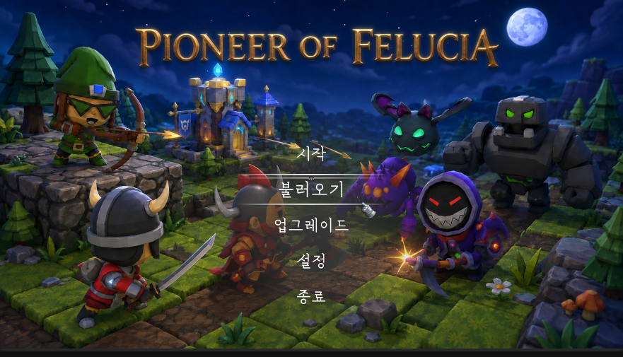
</p>

> 낮에 배치하고 밤에 방어합니다.

---

## 게임 소개

| 항목        | 내용                                                  |
| ----------- | ----------------------------------------------------- |
| 장르        | 타워 디펜스                                           |
| 핵심 플레이 | 웨이브 방어 · Day가 오를수록 적 강화 · 배치·자원 관리 |
| 진행        | 생존하면 다음 낮으로 반복                             |

---

## 프로젝트 소개

| 항목      | 내용                    |
| --------- | ----------------------- |
| 제작 형태 | 4인 팀 프로젝트         |
| 담당      | 맵 시스템 · 세이브/로드 |
| 기간      | 2026.07.08 – 09.04      |

---

## 기술 스택

| 항목        | 내용       |
| ----------- | ---------- |
| 엔진        | Unity 6.3  |
| 구현 언어   | C#         |
| 의존성 주입 | VContainer |
| 비동기 처리 | UniTask    |

---

## 게임 플로우

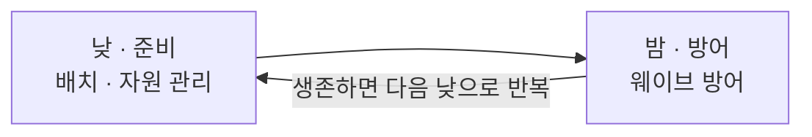

---

## 조작 방법

| 입력                      | 동작             |
| ------------------------- | ---------------- |
| 마우스 왼쪽 클릭 · 드래그 | 타일 선택 · 배치 |
| 마우스 오른쪽 드래그      | 카메라 이동(팬)  |
| W / A / S / D             | 카메라 수평 이동 |
| 마우스 휠                 | 카메라 줌        |

---

## 인게임 스크린샷

### 낮

<p align="center">
  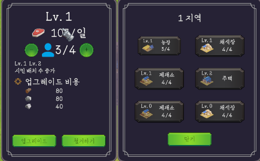
  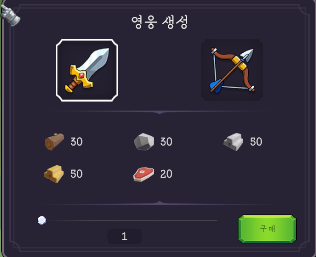
  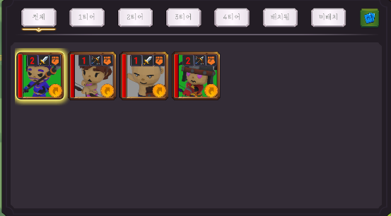
</p>

### 밤

<p align="center">
  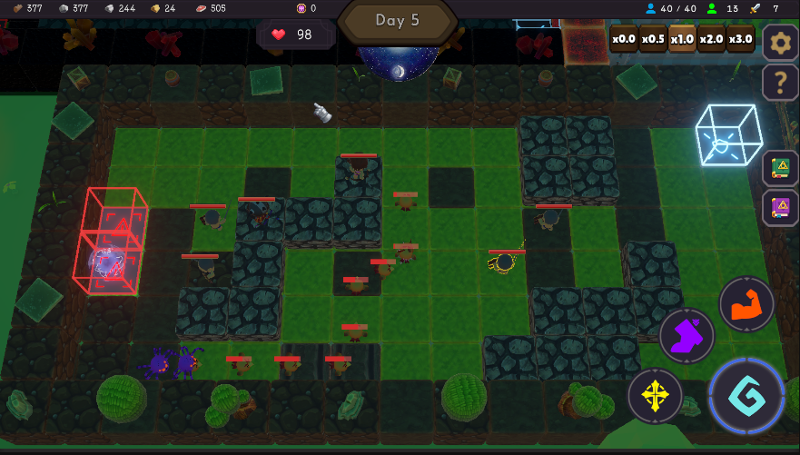
  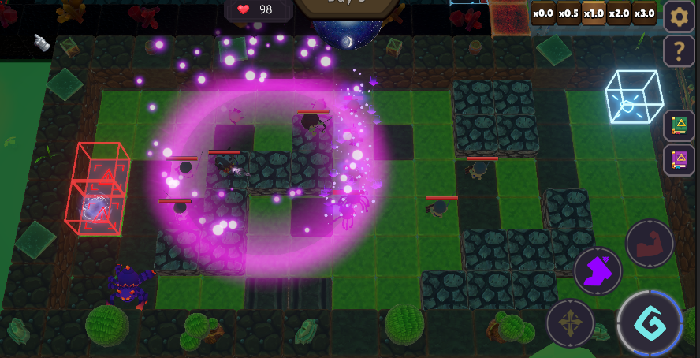
</p>

### 생산

<p align="center">
  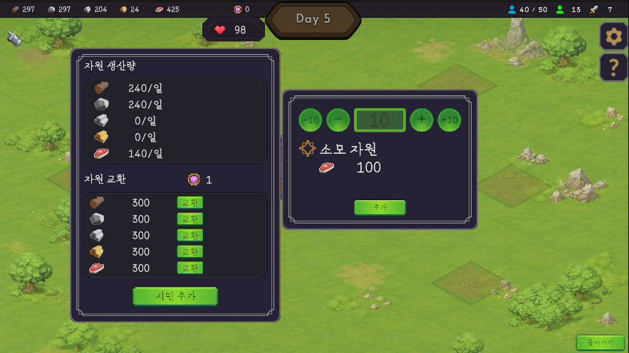
</p>

### 도감

<p align="center">
  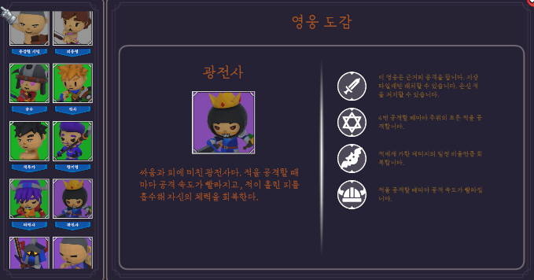
  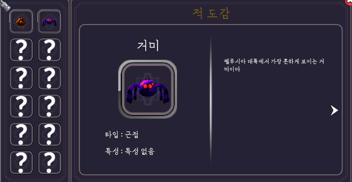
</p>

### 업그레이드

<p align="center">
  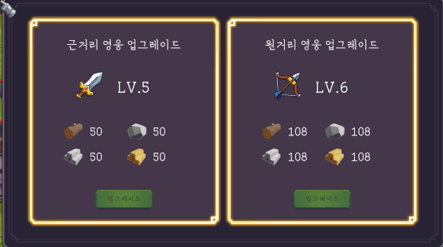
</p>

---

## 담당 영역 — 맵 시스템

### 타일 보드 구성

- `Tile` = 좌표(Col/Row) · 점유자(Occupant/Enemies) · 이웃(NeighborTiles 최대 4)을 보유합니다.
- `TileState` = 상태 4축(지형/통행/기믹/점유)을 보유합니다.
- `MapBoard`는 모듈 Grid 하위 타일들을 `_cells : Dictionary<좌표, Tile>`에 등록합니다. 한 칸에 여러 타일이 겹치면 높은 타일이 대표가 됩니다.
- 저지 판정에서 `MapBoard`는 적→Tile을 찾는 것까지만 담당합니다. 실제 판정 계산은 `BlockCalc.IsBlocked`가 수행합니다.

### 맵 ↔ 유닛

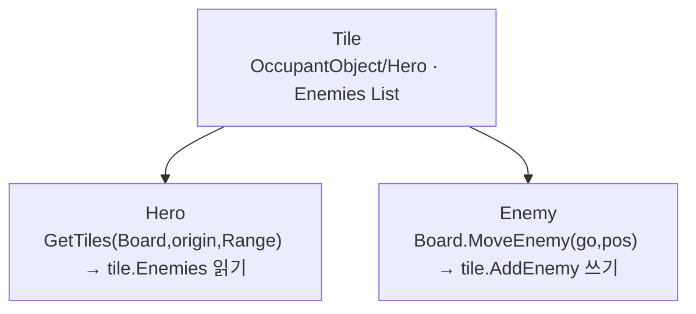

- 타일은 유닛 간 상호작용의 경유 지점입니다.
- 적이 위치를 보고하면 보드가 타일에 등록합니다.
- 영웅은 사거리 내 타일에 적 진입을 체크합니다.
- 근접 영웅이 위치한 타일은 영웅의 저지수만큼 적을 저지합니다.
- 저지수를 초과하면 적은 그 영웅을 통과합니다.

### 커서 ↔ 타일 판정

타일이 이미 자기 위 유닛을 알고 있습니다.

```csharp
public bool HasUnit => OccupantObject != null;
if (!tile.HasUnit) return false;
return tile.OccupantObject.TryGetComponent(out hero);
```

이전에는 레이가 유닛 충돌체에 먼저 닿아, 유닛에 가려진 뒤쪽 칸을 눌러도 유닛이 서 있는 칸으로만 판정되는 문제가 있었습니다. 판정 기준을 타일로 바꿔, 유닛 여부와 무관하게 레이가 지정한 타일에 그대로 도달하도록 해결했습니다.

---

## 담당 영역 — 세이브 / 로드

### 저장 처리 구조

아래 클래스들이 저장 시점 · 상태 변환 · 파일 기록을 나눠 맡습니다.

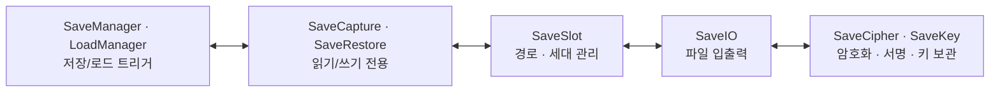

- 저장 트리거 = ① `ChangeToDay`/`ChangeToNight`(하루 2번) + ② `SaveChangeTracker`(낮 동안 자동 감지). ①은 밤에도 작동하는 유일한 저장입니다. ②는 변경이 있으면 정해진 주기(30초)마다 저장하고, 없으면 건너뜁니다.
- 상태 = `Capture`읽기 / `Restore`쓰기로 분리해, 저장값과 실제 상태가 어긋나는 현상을 막습니다.

### 저장 파일 쓰기 3단계

실패해도 기존 파일은 그대로인 3단 쓰기 구조입니다.

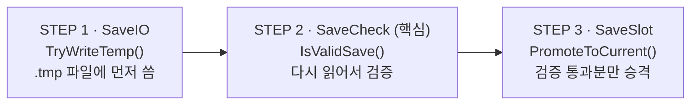

- 쓰기는 실패해도 무해한 구간입니다. 승격은 되돌릴 수 없는 구간입니다. 그 경계에 검증을 세워 깨진 파일이 정식 저장본으로 승격되는 것을 막습니다.

### 로드 복원 핵심

배치를 복원하려면, 그 영웅이 담긴 로스터가 먼저 있어야 합니다.

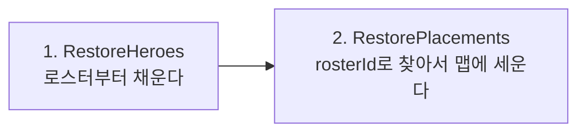

배치 데이터엔 영웅 실체 없이 `rosterId` 하나뿐입니다.

```csharp
// SaveRestore.RestorePlacements
if (!restoredEntries.TryGetValue(save.rosterId, out entry))
    continue;
```

1. `rosterId`로 사전을 조회합니다.
2. 못 찾으면 이번 순회를 건너뜁니다.
3. 찾으면 `entry`에 담아 다음 로직으로 넘어갑니다.

순서가 깨지면 조회 대상 로스터가 없어 찾기에 실패하고, 맵엔 없고 로스터엔 남는 유령 상태가 됩니다.

### 저장 타이밍 설계

게임 로직 코드와 세이브 절차 분리

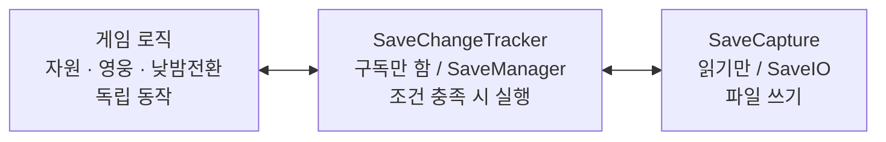

- 구독 = 이미 있는 이벤트(`ProductUpdate` · `CitizenChanged` · `HeroRoster.Changed` · `LevelChanged` 등)를 구독합니다.
- 저장 = 변경이 있으면 정해진 주기(30초)마다 한 번만 실행하고, 변경이 없으면 건너뜁니다. 행동마다 즉시 저장하면 디스크 쓰기가 과도해지므로, 신호는 표시만 해두고 실제 파일 쓰기는 주기적으로 몰아서 처리합니다.
